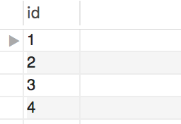
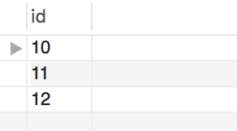

# Joins Are From Descartes, Rows Are From Schemas


### Part 1

* The outputs of following queries are 25 and 10, respectively.

  ```sql
  SELECT COUNT(*)
  FROM first_table;

  SELECT COUNT(*)
  FROM second_table;
  ```

* What will be the number of rows in the output of the following query?

  ```sql
  SELECT *
  FROM first_table, second_table;
  ```  
250

### Part 2

* The query `SELECT * FROM table_one;` returns the following:

  

* And the query `SELECT * FROM table_two;` returns the following:

  


* What will the query `SELECT * FROM table_one, table_two;` look like?

something like:  
id|id
--|--
 1|10
 1|11
 1|12
 2|10
 2|11
 2|12
 3|10
 3|11
 3|12
 4|10
 4|11
 4|12

* _You can use pgAdmin and create a new table to test out this activity_
